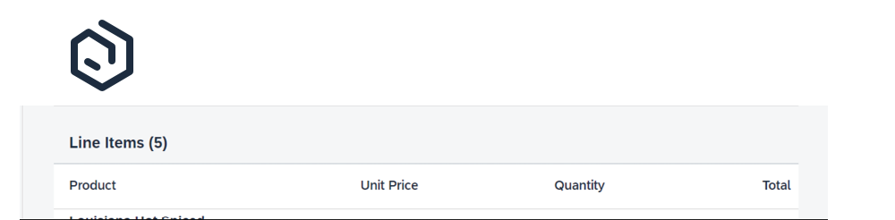
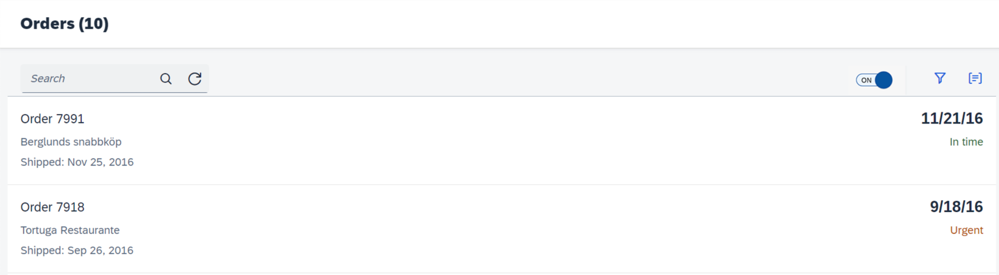

## Requirement:

**1. Write OPA Tests for the below scenarios:**

1. Verify if Order with ID 7918 exists in the main page

2. On navigating to the respective detail page, assert Order details of Order with ID 7918

**2. Display date in the Orders list (master page) in the format - Oct 02, 2023** 

Refer below link for dateformat implementation:
https://sapui5.hana.ondemand.com/sdk/#/topic/91f2eba36f4d1014b6dd926db0e91070

**3. Add a plugin (Product) that displays the list of products associated with the selected order in detail page**

Refer to the Order_Details.json

**4.  Add a toggle button in master page (next to search bar) that controls the visibility of shipping information in detail page**

### Important Points

* OPA test setup structure is uploaded in this repository.
* Please refer below links to get started with OPA:
https://sapui5.hana.ondemand.com/#/topic/2696ab50faad458f9b4027ec2f9b884d.html
https://sapui5.hana.ondemand.com/#/topic/22f175e7084247bc896c15280af9d1dc